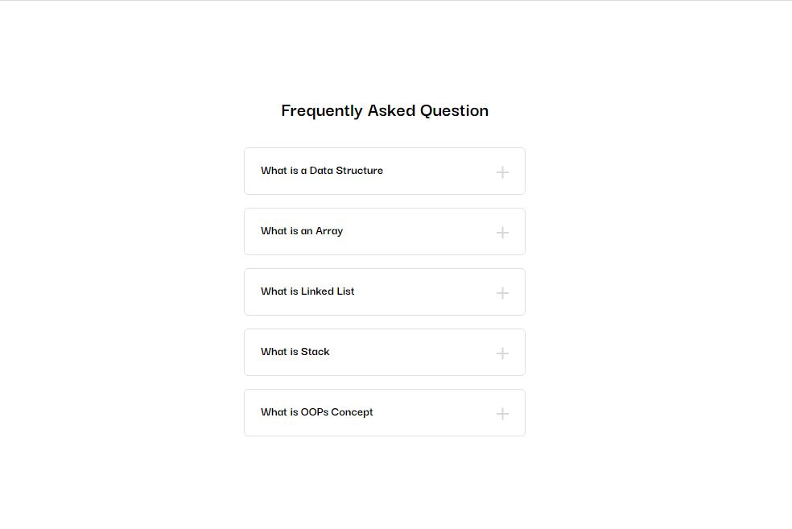

<div align="center">
  
  
  
  

  <br />
  <br />

  <h2 align="center">Simple Accordion</h2>

  Simple Responsive Accordion using HTML, CSS, and JavaScript.

  <a href="https://pawantech12.github.io/accordion/"><strong>➥ Live Demo</strong></a>

</div>

<br />

### Desktop Preview



### Prerequisites

Before you begin, ensure you have met the following requirements:

* You Should Know Basic or Intermediate of HTML ,CSS and JavaScript

### Run Locally

To run **Accordion** locally, run this command on your git bash:

Linux and macOS:

```bash
sudo git clone https://github.com/pawantech12/accordion.git
```

Windows:

```bash
git clone https://github.com/pawantech12/accordion.git
```

### Contact

If you want to contact with me you can reach me at [Instagram](https://www.instagram.com/codewithpawan/).

### License

This project is **Free To Use** and does not contains any license.
